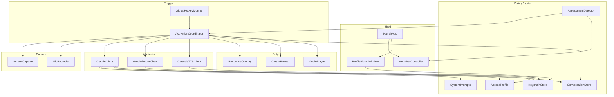
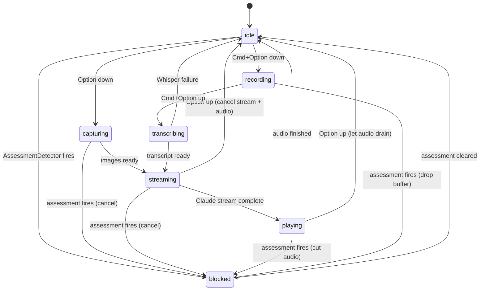
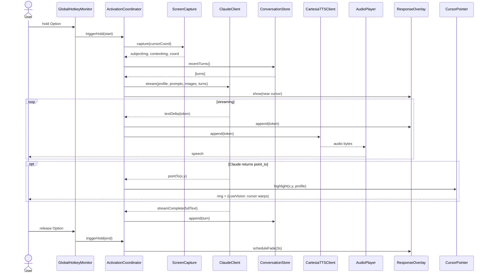
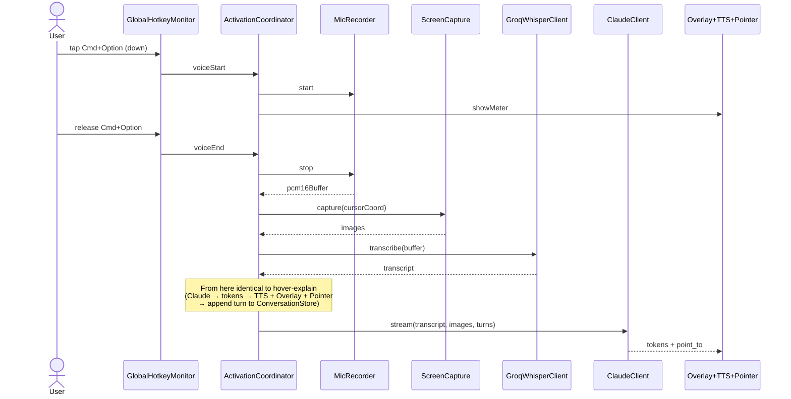
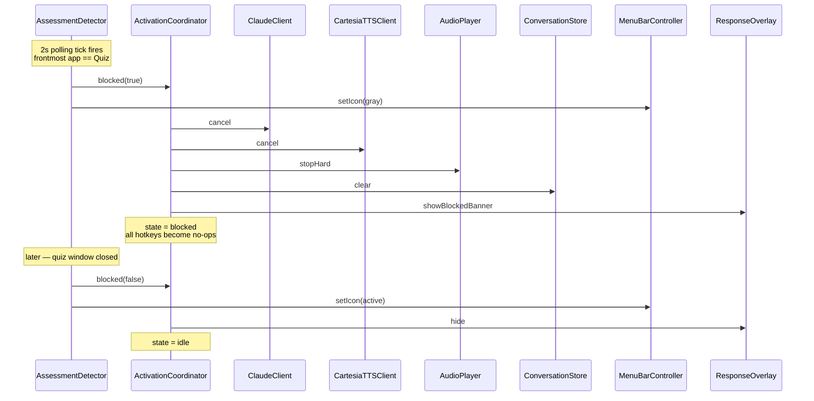

# Narrait — System Architecture

Companion to [README.md](README.md). The README explains *what* and *why*; this doc explains *how the pieces fit together at runtime*. Diagrams render on GitHub.

## 1. Component map

Five layers. Arrows are runtime calls / data flow, not import dependencies.



**Single brain**: `ActivationCoordinator` is the only thing that orchestrates. Everything else is a tool it calls. Keep it that way — no peer-to-peer comms between e.g. `ClaudeClient` and `CartesiaTTSClient`.

**Policy is read, never written, by the AI layer**: `ClaudeClient` reads `SystemPrompts`, `AccessProfile`, `ConversationStore`. It never mutates them. The Coordinator is responsible for appending turns to `ConversationStore` after a successful response.

## 2. Activation state machine

`ActivationCoordinator`'s lifecycle. Drives both UI state and what triggers are allowed.



Notes:
- `blocked` is sticky — only `AssessmentDetector` can leave it. Hotkey events are dropped while blocked.
- `recording` has a 10s hard cap; auto-transitions to `transcribing` if Cmd+Option isn't released.
- A new Option-down while in `playing` cancels current audio and starts fresh from `capturing` — the user always gets the most recent intent.

## 3. Sequence — hover-explain (primary loop)



If `triggerHold(end)` arrives during the streaming loop, the Coordinator calls `cancel()` on `CC` and `TTS` and returns to `idle`. No turn is appended on cancel.

## 4. Sequence — voice-input (second direction)



The screen capture happens *after* recording stops, so the cursor is wherever it ended up — typically still over the subject the user was talking about.

## 5. Sequence — exam-blocker interrupt

The blocker is asynchronous and can fire mid-session. This is the most safety-critical path; rehearse it.



`AP.stopHard` is a hard cut, not a graceful drain — when an exam window appears mid-utterance the audio must stop **immediately**, even mid-word. This is the design choice that makes the exam-blocker demo land.

## 6. Claude request payload shape

What goes over the wire on every Claude call. Pinned here because the rubric enforcement lives in this shape.

```jsonc
{
  "model": "claude-sonnet-4-6",
  "max_tokens": 400,
  "stream": true,
  "system": "<base rubric>\n\n<per-profile clause>",
  "tools": [
    {
      "name": "point_to",
      "description": "Highlight a screen location to direct the user's attention.",
      "input_schema": {
        "type": "object",
        "properties": {
          "x": { "type": "number", "description": "screen X in points" },
          "y": { "type": "number", "description": "screen Y in points" },
          "label": { "type": "string", "description": "short name of element" }
        },
        "required": ["x", "y"]
      }
    }
  ],
  "messages": [
    /* ...up to 6 prior turns from ConversationStore... */
    {
      "role": "user",
      "content": [
        { "type": "image", "source": { "type": "base64", "media_type": "image/jpeg", "data": "<subject crop>" } },
        { "type": "image", "source": { "type": "base64", "media_type": "image/jpeg", "data": "<full-display context>" } },
        { "type": "text", "text": "Cursor at (x=842, y=410). Display 1, 2880×1800 @2x. Mode: hover-explain.  [voice transcript here, if any]" }
      ]
    }
  ]
}
```

Things to *not* mess with:
- `system` is the locked rubric. Per-profile clauses are appended; the base rubric is never replaced or overridden by user input.
- `max_tokens: 400` keeps responses to ~2 sentences for hover, ~1 paragraph for voice walkthroughs.
- The text component always includes the explicit cursor coords + display info — Claude needs this to return correct `point_to` coords.

## 7. Threading model

| Component | Thread | Notes |
|---|---|---|
| `NarraitApp`, `MenuBarController`, `ProfilePickerWindow`, `ResponseOverlay`, `CursorPointer`, `ActivationCoordinator` | `@MainActor` | All UI-touching code + the orchestrator |
| `ClaudeClient`, `GroqWhisperClient`, `CartesiaTTSClient` | Cooperative pool, `async` methods | Results bridged back to main with `await MainActor.run` |
| `ScreenCapture` | Background (SCScreenshotManager), result → main | `NSImage` is main-thread-safe to hand back |
| `MicRecorder` | Real-time audio thread (AVAudioEngine tap), thread-safe ring buffer | Buffer drained on stop |
| `AudioPlayer` | Apple-managed AVAudioPlayer thread | Stop-from-main is safe |
| `AssessmentDetector` | `DispatchSource.makeTimerSource` on background queue, 2s | Posts state changes to main via Combine |
| `GlobalHotkeyMonitor` (CGEventTap) | Run-loop on dedicated thread | Posts events to main |

Concurrency model: Swift `async`/`await` throughout. The Coordinator owns one `Task<Void, Never>?` representing the current session. Triggering a new session cancels the old task first, always.

## 8. Cancellation

Cancellation is not optional — it's load-bearing for the demo. Three things must cancel cleanly:

1. **User releases Option mid-stream** → cancel Claude SSE, drain (or stop) audio, return to `idle`. **No turn appended.**
2. **AssessmentDetector fires mid-stream** → hard cancel everything, clear conversation, lock to `blocked`.
3. **New trigger while previous still running** → cancel the previous, immediately start the new. Coordinator drops the old `Task` reference.

Implementation: every API client checks `Task.isCancelled` between SSE chunks and on each `await`. `CartesiaTTSClient` closes its WebSocket. `AudioPlayer` exposes both `stop()` (graceful, finishes current word) and `stopHard()` (immediate). Use `stopHard()` only on the assessment path.

## 9. Failure modes

| Failure | Detection | UX |
|---|---|---|
| Claude 5xx / timeout | HTTP status, 6s timeout | 1 retry @ 500ms, then TTS: *"Sorry, I can't read the screen right now."* Conversation preserved. |
| Whisper failure | non-200 from Groq | TTS: *"I didn't catch that — try again."* Buffer discarded. |
| Cartesia failure | WebSocket close / non-200 | Skip TTS, render overlay text only. Don't block the response. |
| Screen Recording permission missing | `CGPreflightScreenCaptureAccess` returns false on first trigger | Open `x-apple.systempreferences:com.apple.preference.security?Privacy_ScreenCapture`. Menu bar icon shows warning badge. |
| Mic permission missing | `AVAudioApplication.requestRecordPermission` returns false | Voice trigger no-ops; overlay: *"Microphone access needed for voice input."* |
| Accessibility (event-tap) permission missing | `AXIsProcessTrustedWithOptions(prompt: true)` | Hotkeys won't fire. Persistent warning in menu bar. |
| Cursor over Narrait's own panel | Filter via `SCContentFilter.excludingApplications([self])` | Capture excludes our windows, so we never describe ourselves. |
| Multi-display, cursor on second display | `NSEvent.mouseLocation` matched against `NSScreen.screens[i].frame` | Capture only the display the cursor is on. Pass display ID + scale factor in request payload. |
| Network drops mid-stream | Task throws / SSE socket closes | Cancel + TTS: *"Lost connection while reading the screen."* |
| Demo Mac on bad venue wifi | n/a | Pre-cache the system rubric; warm a TLS connection to all three APIs at app launch. Show a red dot in the menu bar if any of the three connection warmers fail. |

## 10. State persistence

| Lives where | What | Why |
|---|---|---|
| Keychain | Anthropic + Groq + Cartesia API keys | Standard sensitive-data store |
| `UserDefaults` | Selected `AccessProfile`, hotkey customizations, "first launch done" flag | Small, non-sensitive, per-user |
| In-memory only | `ConversationStore`, last screen captures | Privacy: gone on quit. Freshness: stale context produces bad responses. |
| Bundled | `SystemPrompts.swift` rubric, `QuizMockApp`, demo PDFs | Not user-editable; the rubric especially is part of the binary's identity. |

The rubric being in code rather than config is deliberate — judges should be able to point at the source file and verify the cheating-tool defense. If the rubric were a config file, it'd be overrideable.

---

End of architecture. The README has the build order, the demo script, and the verification checklist. Together those two docs should be enough to start writing Swift.
