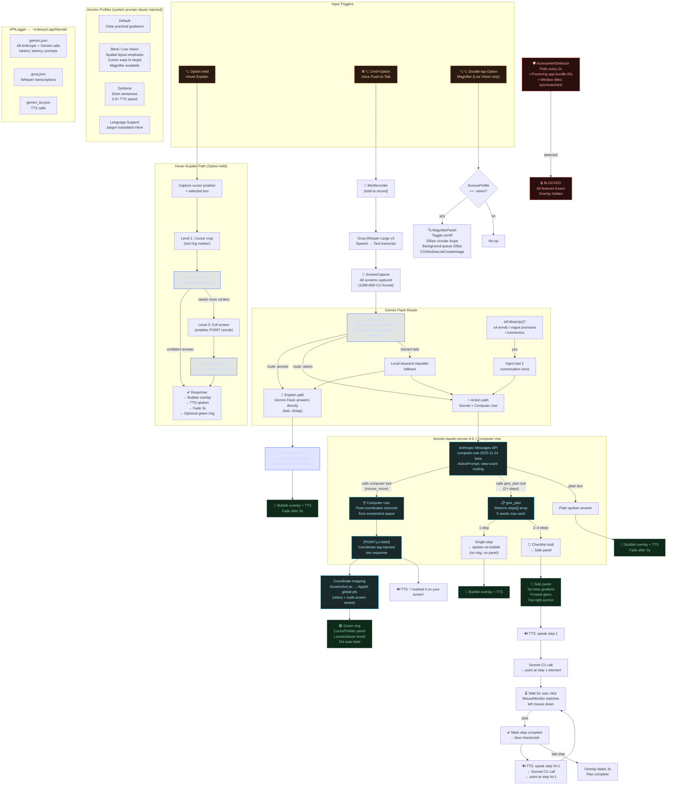

# Narrait — System Design

## Component Summary

| Component | Role | Model/Tech |
|---|---|---|
| `GlobalHotkeyMonitor` | Detects Option / Cmd+Option / double-tap | AppKit flags monitor |
| `AssessmentDetector` | Polls for proctoring apps + quiz windows every 2s | CGWindowListCopyWindowInfo |
| `GeminiFlashRouterClient` | Routes voice queries: answer vs action | gemini-2.5-flash-preview |
| `GeminiClient.stream()` | Sonnet call with Computer Use + give_plan tools | claude-sonnet-4-6 |
| `GeminiFlashRouterClient.answer()` | Direct Gemini answer (explain path + hover) | gemini-2.5-flash-preview |
| `GroqWhisperClient` | Speech-to-text | whisper-large-v3 |
| `GeminiTTSClient` | Text-to-speech | Cartesia Sonic / macOS TTS |
| `CursorPointer` | Green ring overlay at CU coordinates | NSPanel .screenSaver level |
| `MagnifierPanel` | Live 2× circular loupe | CGWindowListCreateImage 20fps |
| `ResponseOverlay` | Bubble + side panel UI | SwiftUI NSPanel |
| `ConversationStore` | Last N turns for follow-up context | In-memory |
| `AccessProfile` | Injects clause into every system prompt | UserDefaults |
